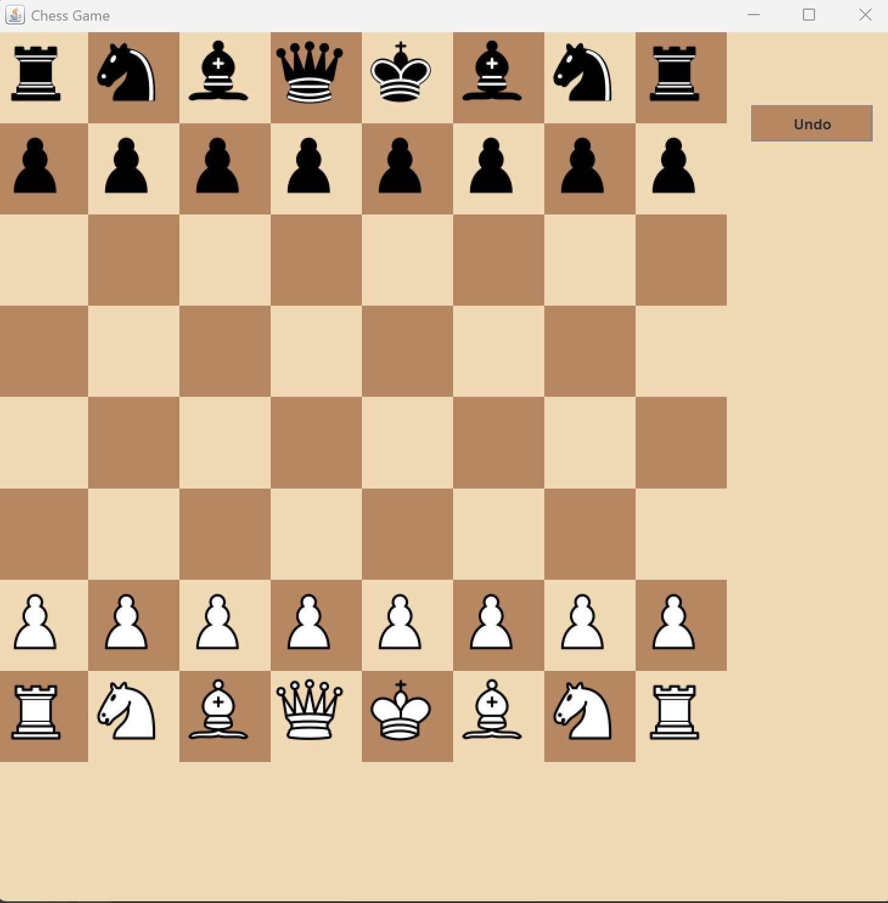

# ♟️ Chess Game in Java

A complete chess game developed in Java using a 2D graphical interface. This project allows two players to play chess on the same machine, supporting all standard rules including castling, pawn promotion, and checkmate detection.

---

## 🎯 Features

- ✅ 2D GUI-based chessboard with images for all pieces  
- ✅ Full rule implementation (legal moves, check, checkmate)  
- ✅ Pawn promotion  
- ✅ Move history and undo functionality  
- ✅ Clean OOP design with MVC-like structure  

---

## 📸 Screenshots



---

## 🛠️ Technologies

- Java (JDK 8+)  
- NetBeans IDE  
- Swing (for GUI)  
- Object-Oriented Programming design patterns  

---

## 📂 Folder Structure
ChessCoreLab/
├── src/
│ ├── ChessCore/ # Game logic
│ ├── ChessCore/Pieces/ # Chess piece classes
│ └── GUI/ # GUI implementation
├── ChessImages.png/ # PNG images for chess pieces
├── build.xml # Build configuration
└── .gitignore # Git ignore file

---

## 🚀 Getting Started
1. Clone the repository:
   ```bash
   git clone https://github.com/KarenSamehS/ChessGameJava.git
2. Open the project in NetBeans IDE
3. Run the project and start playing!
